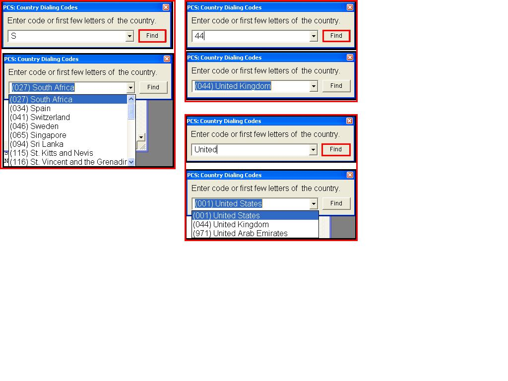



## Country Dialing Codes

### Description

Get A Countrys Dialing Code. DID YOU KNOW: All countries and their dialing codes are stored in the registry. Excellant snippet to add to your business applications and contact apps etc
 
### More Info
 

             |
---                |---
**Submitted On**   |2006-08-02 18:56:06
**By**             |[Steven Atkiss](https://github.com/Planet-Source-Code/PSCIndex/blob/master/ByAuthor/steven-atkiss.md)
**Level**          |Intermediate
**User Rating**    |5.0 (25 globes from 5 users)
**Compatibility**  |VB 5\.0, VB 6\.0
**Category**       |[Registry](https://github.com/Planet-Source-Code/PSCIndex/blob/master/ByCategory/registry__1-36.md)
**World**          |[Visual Basic](https://github.com/Planet-Source-Code/PSCIndex/blob/master/ByWorld/visual-basic.md)
**Archive File**   |[Country\_Di201753932006\.zip](https://github.com/Planet-Source-Code/steven-atkiss-country-dialing-codes__1-66449/archive/master.zip)

